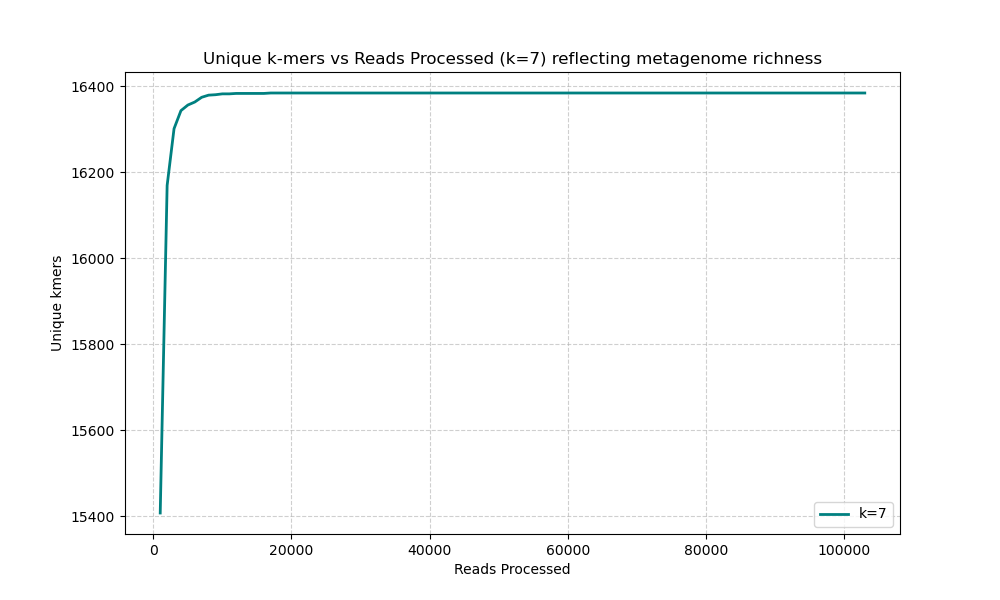

# Metagenomic K-mer Diversity Analysis 🧬📊

### 🎓 MSc in Bioinformatics Project
This project explores the genetic complexity of metagenomic samples (specifically human gut microbiome) using an alignment-free approach based on **K-mer frequency distribution**.

### 🔍 Project Overview
The pipeline processes high-throughput sequencing data to determine the diversity and information content of a sample.

- **K-mer Extraction**: Efficiently parses gzipped FASTQ files to count substrings of length *k* (k=4 to 7).
- **Shannon Entropy Analysis**: Measures the statistical diversity of the k-mer profiles to evaluate the biological complexity.
- **Convergence Monitoring**: Implements an automated stop-mechanism that detects when the entropy stabilizes, ensuring optimal processing of large datasets.
- **Rarefaction Curves**: Visualizes the discovery rate of unique k-mers against the number of reads processed to confirm sequencing saturation.


### 🛠 Tech Stack
- **Python 3.x**
- **Libraries**: `NumPy` (Entropy calculation), `Matplotlib` (Rarefaction plotting), `Argparse` (CLI support).

### 🚀 Usage
The script accepts a compressed FASTQ file and an optional k-mer size:
```bash
python PROJECT_4_Metagenomic-Kmer-Diversity-Analysis.py your_sample.fq.gz -k 7
```

### 📊 Scientific Conclusion
The analysis demonstrated a clear saturation plateau, confirming that the sequencing depth was sufficient to capture the full k-mer diversity of the microbiome sample, with high data quality and minimal noise.

### 📊 Example Output
```text
Initializing k-mer analysis for k=[7] with step 1000 reads.
Convergence reached for k=7 at 103000 reads with entropy difference 8.227818723227642e-06

All k values have converged. Stop analysis.

Final Results:

=================================================================
k     Shannon Entropy      Reads Processed      Total k-mers   
-----------------------------------------------------------------
7     13.81222             103,000              7,106,870      
=================================================================
```


